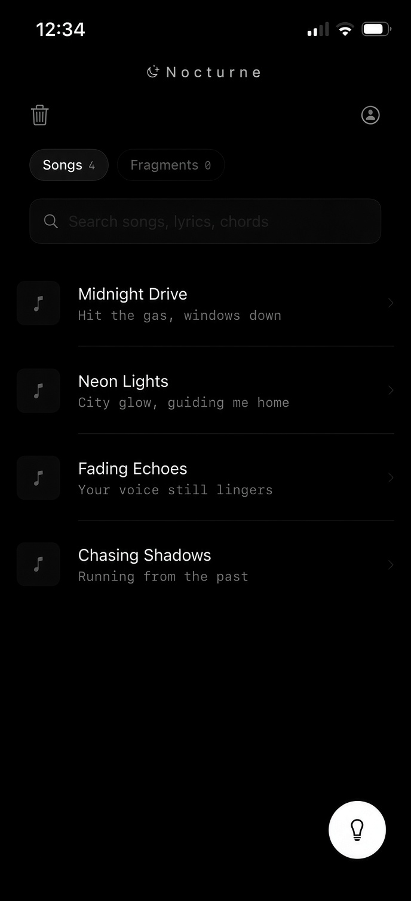
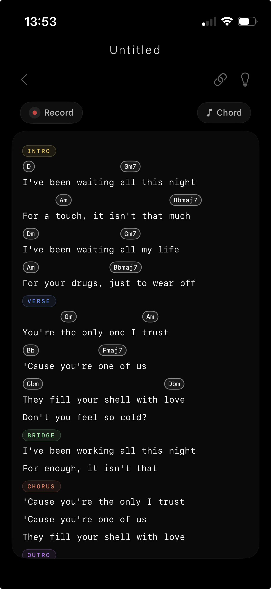
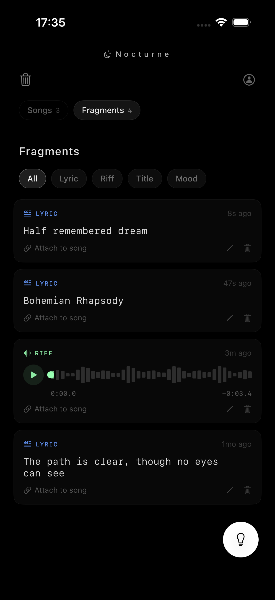
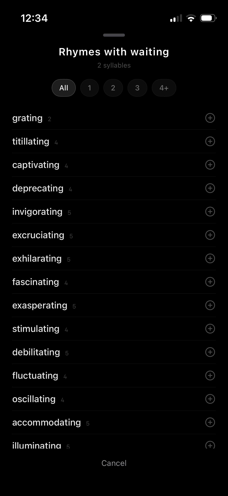
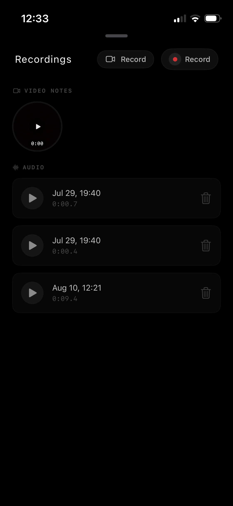
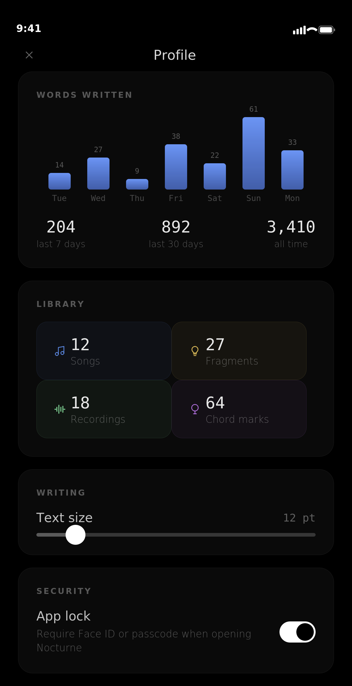

# Nocturne

<p align="center">
  
</p>

<h3 align="center">
A privacy-focused songwriting app built with SwiftUI.
</h3>

<p align="center">
Write lyrics, organize songs, and capture musical ideas in a focused native iOS experience.
</p>

---

## Overview

Nocturne is a native iOS songwriting application designed for musicians and creators who want a simple, private, and distraction-free environment for writing music.

The app focuses on the core songwriting workflow: writing lyrics, organizing song structures, managing chords, and recording ideas without unnecessary social features or distractions.

---

## Features

### 🎵 Songwriting Workspace

* Create and organize songs
* Write lyrics with chord support
* Structure songs using customizable sections
* Add notes and ideas while composing
* Quickly navigate through different parts of a song

### 🎸 Chords & Lyrics

* Display chords alongside lyrics
* Build structured songwriting documents
* Keep musical ideas organized in one place
* Support for different songwriting workflows

### 🎙 Audio Recording

* Record musical ideas directly inside the app
* Capture melodies, riffs, and demos while writing
* Keep recordings connected to your songwriting process

### 🔒 Privacy First

* Offline-first design
* Local data storage
* Face ID authentication
* No social feed or unnecessary data collection

Your songs and ideas stay focused on your creative process.

### 📄 Export

* Export songs as PDF documents
* Share songwriting drafts easily
* Create clean documents for collaboration

---

## Screenshots

<p align="center">
  
  
  
</p>

<p align="center">
  
  
  
</p>

---

## Technical Details

### Built With

* **Swift**
* **SwiftUI**
* **SwiftData**
* **AVFoundation**
* **LocalAuthentication**
* **MVVM Architecture**

### Architecture

Nocturne follows a clean MVVM architecture designed for maintainability and scalability.

The project separates:

* Views
* ViewModels
* Models
* Persistence layer
* Audio services

---

## Requirements

* iOS 17.0+
* Xcode 16+
* Swift 5.9+

---

## Installation

Clone the repository:

```bash
git clone https://github.com/Damoon03/NocturneMain.git
```

Open the project:

```bash
cd NocturneMain
open Nocturne.xcodeproj
```

Build and run using Xcode.

---

## Development

This project was built as a native iOS application with a focus on:

* Modern SwiftUI development
* Clean architecture
* Offline-first applications
* User privacy
* Thoughtful user experience design

---

## Future Improvements

Planned improvements:

* Additional export options
* More songwriting tools
* Enhanced audio workflow
* More customization features

---

## Author

**Damoon Saber**

iOS Developer focused on building native iOS applications with Swift and SwiftUI.

---

## License

This project is currently available for portfolio and demonstration purposes.
