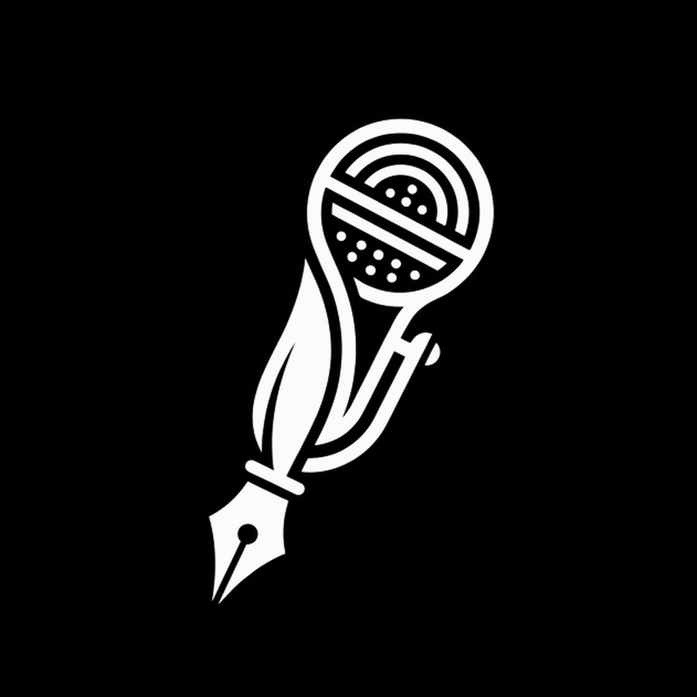
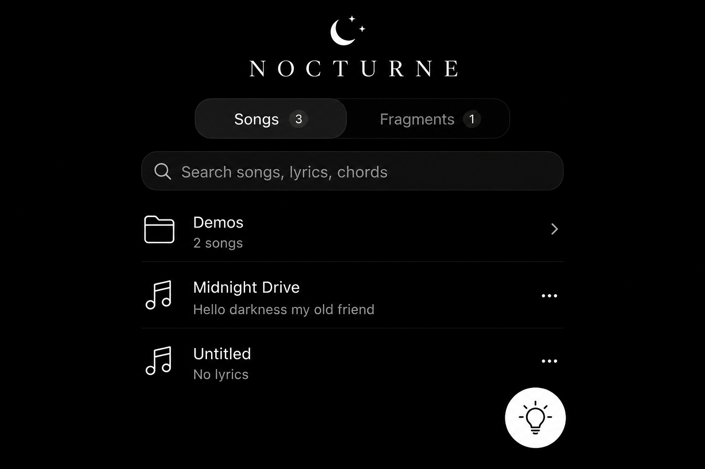
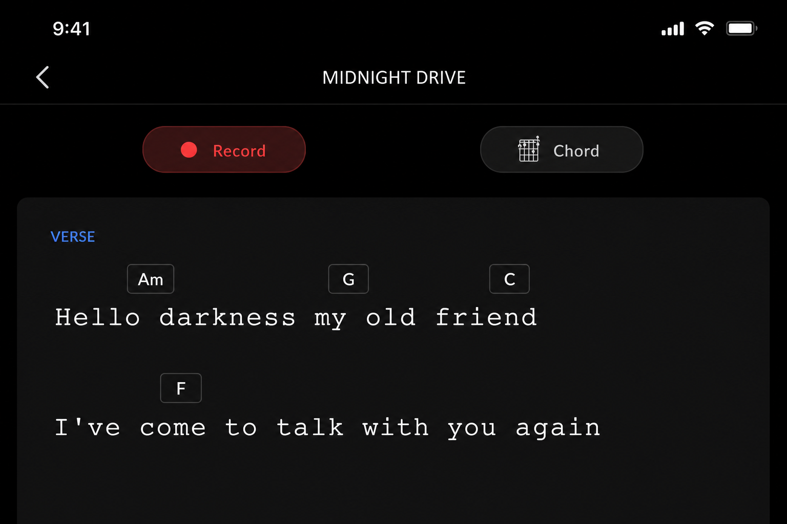
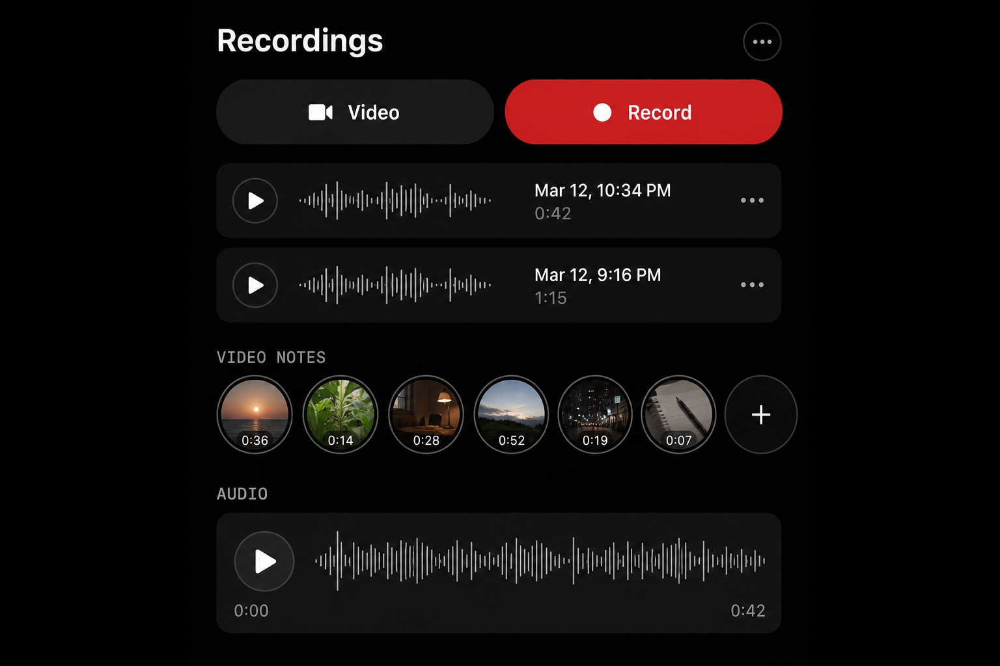
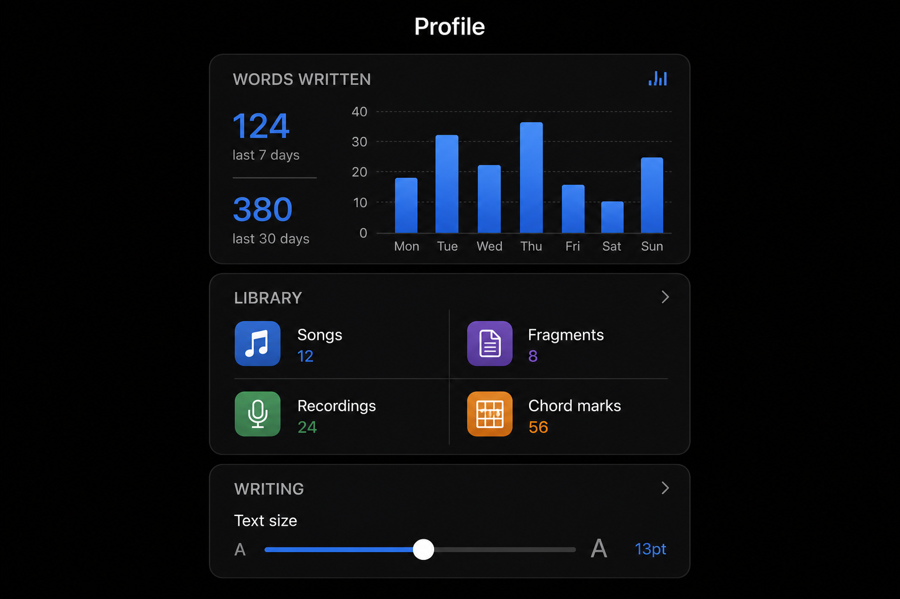

<p align="center">
  
</p>

<h1 align="center">Nocturne</h1>

<p align="center">
  <strong>A songwriter's sketchbook for iOS.</strong><br>
  Write lyrics, place chords, record ideas, and organize your work — all in a calm, distraction-free dark interface.
</p>

<p align="center">
  
  
  
  
  
</p>

---

## Screenshots

<p align="center">
  
  &nbsp;
  
  &nbsp;
  
  &nbsp;
  
</p>

<p align="center"><em>Library · Song editor · Recordings · Profile</em></p>

> **Note:** Replace screenshots in `docs/screenshots/` with captures from a real device or simulator for App Store–exact visuals. Filenames: `01-library.png`, `02-song-editor.png`, `03-recordings.png`, `04-profile.png`.

---

## Overview

**Nocturne** is a native SwiftUI app built for musicians who think in lyrics, chords, and voice memos. Instead of treating chords as inline text markers, Nocturne stores them as structured data anchored to specific words — so charts stay aligned no matter how you edit.

Everything lives **on your device**. No account, no cloud sync, no tracking.

---

## Features

### Write & arrange
- Distraction-free **lyrics editor** with monospaced type and adjustable text size
- **Chords above words** — tap a word, place a chord; transpose in one step
- **Section labels** — Verse, Chorus, Bridge, and more
- **Line notes** for reminders and alternate ideas
- Undo / redo while you write

### Capture & record
- **Audio memos** per song — record while you write
- **Video notes** — short front-camera clips attached to a track
- Star **main recordings** to mark your best take
- **Fragments** — quick saves for lyric lines, riffs, titles, and moods

### Organize & find
- **Folders** for demos, finished work, experiments
- **Search** by title, lyrics, or chord name
- **Soft delete** with 30-day recovery in Recently Deleted

### Share & export
- **PDF chord charts** with lyrics and section labels
- **Nocturne links** (`nocturne://`) — read-only in-app preview for collaborators
- Plain-text export via the system share sheet

### Privacy & security
- All songs, fragments, and recordings stored **locally**
- Optional **Face ID / passcode app lock**
- Microphone and camera used only when you record

---

## Requirements

| | |
|---|---|
| **OS** | iOS 17.0 or later |
| **Devices** | iPhone, iPad |
| **Build** | Xcode 15+ |
| **Account** | Apple Developer Program (for App Store distribution) |

---

## Getting started

### Clone & open

```bash
git clone https://github.com/Damoon03/Nocturne.git
cd Nocturne
open Nocturne.xcodeproj
```

### Run

1. Select your **Development Team** under **Signing & Capabilities**
2. Choose a simulator or connected iPhone
3. Press **⌘R** to build and run

### Archive for App Store

1. Set destination to **Any iOS Device (arm64)**
2. **Product → Archive**
3. **Distribute App → App Store Connect**

---

## Project structure

```
Nocturne/
├── Nocturne/
│   ├── Model/           Song, Chord, Fragment, Recording
│   ├── ViewModel/       Library, Song, Audio, Settings
│   ├── View/            Library, Song editor, Recording, Profile
│   ├── Utilities/       Export, share links, persistence
│   └── Assets.xcassets/ App icon, accent color
├── docs/screenshots/    README & marketing screenshots
├── URLTypes.plist       nocturne:// deep link scheme
└── Nocturne.xcodeproj
```

---

## Permissions

Nocturne requests sensitive capabilities only when you use them:

| Permission | Purpose |
|------------|---------|
| **Microphone** | Audio memos for songs and fragments |
| **Camera** | Video notes attached to a song |
| **Face ID / Touch ID** | Optional app lock (Profile → Security) |

---

## Data & privacy

- **Songs, folders, fragments** — JSON in Application Support (`DataPersistence`)
- **Audio / video files** — stored in the app Documents directory
- **Settings & stats** — UserDefaults (font size, word counts, app lock)
- **No analytics, no third-party SDKs, no network calls**

Legacy data in UserDefaults is migrated automatically on first launch after updating.

---

## Share links

Share links encode a read-only snapshot (title, lyrics, chords, sections) into a URL:

```
nocturne://song/<payload>
```

Opening the link in Nocturne shows a preview. **Audio is not included** — file paths are device-local. Attach recordings separately via AirDrop or Files if needed.

---

## Tech stack

- **SwiftUI** — UI and navigation
- **UIKit bridges** — `UITextView` lyrics editor, PDF export, share sheet
- **AVFoundation** — audio recording/playback, video capture
- **LocalAuthentication** — biometric app lock
- **Combine** — debounced auto-save

No external dependencies.

---

## Roadmap

- [ ] iCloud backup (optional)
- [ ] Alternate app icons
- [ ] Additional export formats
- [ ] Localization

---

## Author

**Damoon Saber** — [GitHub @Damoon03](https://github.com/Damoon03)

---

## License

Copyright © 2026 Damoon Saber. All rights reserved.

This project is proprietary. Unauthorized copying, distribution, or commercial use is not permitted without permission.

---

<p align="center">
  
  <br>
  <sub>Made for late-night writing sessions.</sub>
</p>
